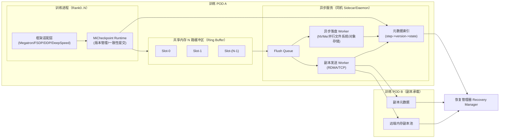

# MiCheckpoint 高性能 Checkpoint 技术方案

## 1. 背景与目标

MiCheckpoint 的目标是构建一个**通用（V3next / Megatron / FSDP / DeepSpeed）**、**实时（PerStep）**的 Checkpoint 保存与恢复方案，为大模型 Core 及业务团队提供高效的：

- 训练进程内存检查点（Memory Checkpoint）
- 异步落盘（Asynchronous Persist）
- 副本恢复（Replica-based Recovery）

核心价值：

1. **减少训练阻塞**：Checkpoint 写入路径以共享内存为主，训练主流程仅承担轻量级拷贝与元数据提交，整体阻塞控制在秒级以内。
2. **提升恢复速度**：跨节点维护热副本，节点故障时优先从远端内存副本恢复，降低恢复时延。
3. **统一接入体验**：以框架适配层封装差异，使用方式尽量保持“一行替换”。

---

## 2. 设计原则

1. **通用性优先**：统一抽象状态字典（Model / Optimizer / LR Scheduler / RNG / Dataloader State），屏蔽不同框架差异。
2. **训练主流程最小侵入**：只替换 `save_checkpoint/load_checkpoint` 接口，不改变训练循环主体逻辑。
3. **写入路径解耦**：训练进程只负责“写内存 + 提交版本”，落盘与副本传输由后台异步执行。
4. **可控一致性**：通过版本状态机保证“可恢复版本”可判定，避免半写入版本污染恢复。
5. **可退化恢复**：恢复路径按“本地内存 > 本地磁盘 > 远端内存 > 远端磁盘”降级，确保高可用。

---

## 3. 用户接口（示例）

```python
# megatron
from micheckpoint.megatron import save_checkpoint, load_checkpoint

# torch DDP
from micheckpoint.torch import save_checkpoint, load_checkpoint

# torch FSDP
from micheckpoint.torch import save_checkpoint, load_checkpoint
```

接入方式：将原框架保存/加载接口替换为 MiCheckpoint 提供的同名接口，训练代码其余部分保持不变。

---

## 4. 总体架构



---

## 5. 核心模块设计

### 5.1 框架适配层（Adapter Layer）

- 提供统一 API：`save_checkpoint(step, state)` / `load_checkpoint(...)`
- 处理框架特有状态：
  - Megatron：模型并行/流水并行状态
  - FSDP：分片参数与 optimizer state 聚合/切分
  - DDP/DeepSpeed：分布式 rank 维度状态协调
- 输出统一“逻辑 checkpoint 包”：`{model, optim, sched, rng, dataloader, metadata}`

### 5.2 共享内存 N 路缓冲区

- 使用固定大小 Slot 的 Ring Buffer（`N >= 2`，推荐 `N=3~8`）
- 每个 Slot 生命周期：
  - `FREE -> WRITING -> SEALED -> FLUSHING -> (PERSISTED/REPLICATED) -> FREE`
- 训练线程只写 `WRITING` Slot，写完后原子置为 `SEALED`
- 异步线程仅消费 `SEALED` Slot，避免训练线程与落盘线程互锁

### 5.3 异步落盘管线

- 由独立 Worker 池执行：
  1. 数据压缩/切片（可选）
  2. 并发写本地 NVMe 或远端存储
  3. 落盘成功后更新元数据状态
- 支持多级存储策略：
  - L1：本地 NVMe（恢复优先）
  - L2：并行文件系统/对象存储（长期保存）

### 5.4 远端内存副本

- 关键版本（如每 `k` step 或最近 `m` 个版本）异步复制到其他 POD 内存池
- 副本写入同样使用版本状态机，确保“只恢复已完成副本”
- 目标：单节点崩溃时，无需等待完整落盘即可快速恢复训练

### 5.5 元数据与一致性

每个版本维护如下元信息：

- `version_id`（通常含 global_step + wallclock + rank group）
- `state`：`SEALED | FLUSHING | PERSISTED | REPLICATED | CORRUPTED`
- `checksum` / `size` / `tensor_manifest`
- `storage_location`（本地、远端内存、副本位置）

可恢复版本判定规则（示例）：

1. `PERSISTED == true`，或
2. `REPLICATED == true` 且校验通过

---

## 6. 关键数据流

### 6.1 保存流程（PerStep）

1. 训练到达保存点（可每 step 或按策略触发）
2. 适配层序列化逻辑状态，写入共享内存空闲 Slot
3. Runtime 原子提交版本元数据（`SEALED`）
4. 训练线程立即返回继续训练
5. 异步服务消费 Slot，执行落盘与副本传输
6. 更新版本状态到 `PERSISTED/REPLICATED`

### 6.2 恢复流程（单 POD 故障）

恢复优先级：

1. 本地共享内存最新可恢复版本
2. 本地磁盘最新可恢复版本
3. 远端内存副本最新可恢复版本
4. 远端持久化存储版本

恢复管理器选择“最新且一致”的版本，完成参数与优化器状态回灌后继续训练。

---

## 7. 背压策略（Backpressure）

当异步落盘吞吐低于生成速率时，支持以下策略：

1. **阻塞等待（BLOCK）**
   - 当无空闲 Slot 时，训练线程短暂等待
   - 优点：版本完整；缺点：可能影响吞吐

2. **仅保留最新（KEEP_LATEST）**
   - 覆盖未落盘旧版本，优先保证最新状态可恢复
   - 适合重视“最新恢复点”场景

3. **固定间隔保证（INTERVAL_GUARANTEE）**
   - 保证每 `k` step 至少有一个版本完成落盘
   - 其余 step 可降级为内存态或被合并
   - 在吞吐与可靠性间提供可控折中

建议默认策略：`INTERVAL_GUARANTEE(k=10)` + `KEEP_LATEST` 组合。

---

## 8. 性能与可靠性目标（建议）

- **保存开销**：训练主线程额外阻塞时间控制在秒级（随模型规模线性增长，尽量不影响 step 节奏）
- **恢复耗时**：单节点故障后优先内存副本恢复，目标显著低于全量远端拉取
- **可用性**：单 POD 故障场景下可自动恢复并继续训练
- **一致性**：仅暴露“可恢复版本”，避免读取半写入数据

---

## 9. 演进路线（Roadmap）

### Phase 1：基础可用
- 完成 Megatron/FSDP 接口适配
- 打通共享内存 N 路缓冲 + 异步落盘
- 支持 BLOCK / KEEP_LATEST 策略

### Phase 2：高可用增强
- 增加跨 POD 内存副本
- 引入恢复优先级与自动故障切换
- 增加 INTERVAL_GUARANTEE 策略

### Phase 3：全栈优化
- 零拷贝/分层压缩/增量 checkpoint
- 智能策略（基于写入队列水位与训练速度自适应）
- 完善可观测性（时延、队列深度、恢复成功率）

---

## 10. 可观测性与运维建议

建议暴露以下指标：

- `checkpoint_enqueue_latency_ms`
- `checkpoint_train_block_time_ms`
- `checkpoint_flush_q_depth`
- `checkpoint_persist_throughput_mb_s`
- `checkpoint_replica_lag_step`
- `checkpoint_recovery_time_s`
- `checkpoint_recovery_success_rate`

并提供告警：

- 队列深度持续超阈值
- 连续多个版本未落盘成功
- 远端副本延迟超过 SLA
- 恢复失败或版本校验失败

---

## 11. 总结

MiCheckpoint 通过“**训练进程写共享内存 + 异步落盘 + 远端内存副本恢复**”技术路线，在保证通用性和低侵入的同时，显著降低 checkpoint 对训练吞吐的影响，并提升单节点故障场景下的恢复效率，是面向大模型训练的高性能、高可用 checkpoint 基础设施方案。
